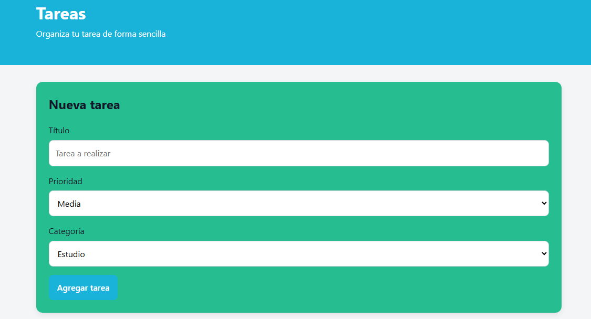
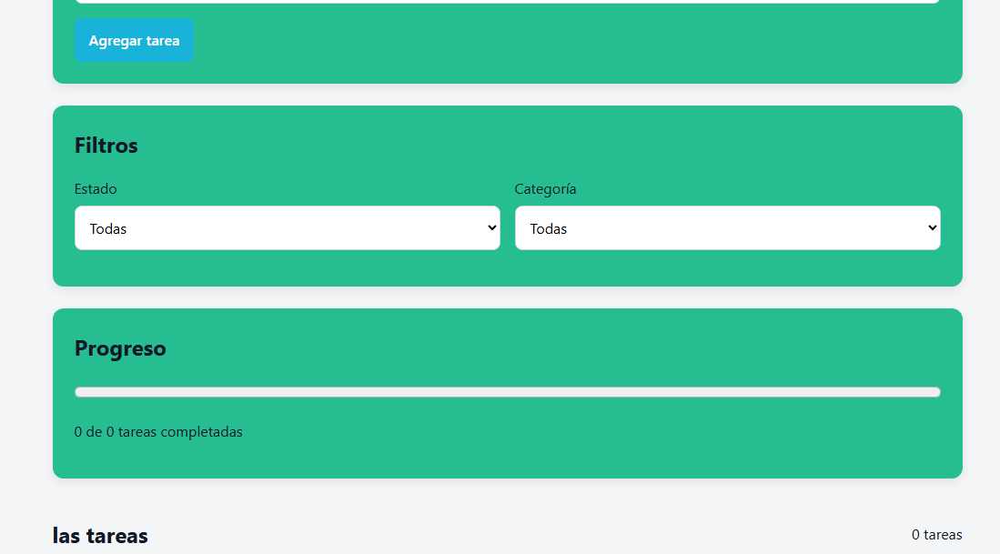

# DIA 20
## Guion 
Demostrar la estabilidad del despliegue,  el valor del proyecto y el estado del repositorio.

navega por las rutas principales de la aplicacion, fuerza una ruta arreonea para mostrar la pantalla 404 y luego pasa a la pestalla del repositorio de GitHub

## Ensayo
 Lee el guion realizado las interacciones reales en pantalla cronometra que cada seccion encaje dentro de los 3 minutos sin acelerar el hablar.

Desconecta la red un segundo o abre las herramientas del desarrollador para asegurarte de saber reaccionar con calma ante cualquier imprevisto 

## 5 Preguntas Dificiles
1. ¿ Que ocurre en la produccion si el trafico aunmenta drasticamente y el hosting gratuito colapsa o supera sus limites?
*  utilizamos servicios con planes gratuitos (como GitHub Pages, Vercel o Netlify), un pico de trafico no anticipado puede agotar el ancho de bandaa mensual asignado o superar los limites de ejecucion de funciones

2. Si un usuario abre la URL publica y la aplicacion falla completamente por un bug de JaveScript no detectado ¿cual es el procedimiento inmediato?
* Al estar publicada la etiqueta v1.0.0, no se deben aplicar parches improvisados directamente en la rama pricipal (main). El procedimiento correcto es utilizar la funcion de rollback en la plataforma de despliegue para regresar a la ultima version en segundos

3. Si el usuario escanea el codigo QR y la pagina web tarda mas de 5 segundos en cargar en su telefono ¿ donde esta el cuello de botella?
* El problema suele residir en la falta de optimizacion para redes moviles, imagenes sin comprimir en forma PNG/JPG en lugar de webp. Ausencia de lazy loading en recursos secundarios inclusion de paquetes de JaveScript demasiado grandes sin divicion de codigos

4. ¿ Porque la version v1.0.0 no incluye aun todas las funcionalidades planeadas en la idea iriginal del proyecto?
* Porque intentar lanzar un producto "con todo incluido" suele derivar en software que nunca se publica la version v1.0.0 presental el Producto Minimo Variable (MVP) funcional y estable: Cumple la promesa del proyecto con calidad de codigo, documentacion y accebilidad

5. Que tan seguro es el codigo desplegado frente a vulnerabilidades basicas (XSS, exposicion de datos o inyeccion)
* Si el sitio es puramente estatico, los riesgos de servidor son minimos, pero aun existen vulnerabilidad en el cliente como Cross-Site Scripting (XSS) si se maneja contenido introducido por usuarios sin sanitizar. Una auditoria honesta reconoce que sin la implementacion de encabezados de seguridad singuroso

## URL
https://github.com/diegoalexaa209-dot/envio/blob/main/dia-10/dia-10.html

## aplicacion 

